# 🏨 Azure Stay Revenue Analysis  
## การวิเคราะห์ปัจจัยที่ส่งผลต่อรายได้ของโรงแรมและประสิทธิภาพการตั้งราคา

## 📊 Project Canvas

ภาพนี้แสดงภาพรวมของโครงการ โดยสรุปปัญหาทางธุรกิจ เป้าหมายในการวิเคราะห์ สมมติฐานที่ใช้ และตัวชี้วัดสำคัญ ซึ่งเป็นพื้นฐานในการออกแบบการวิเคราะห์และสร้าง Insight เพื่อสนับสนุนการตัดสินใจด้าน Revenue Management

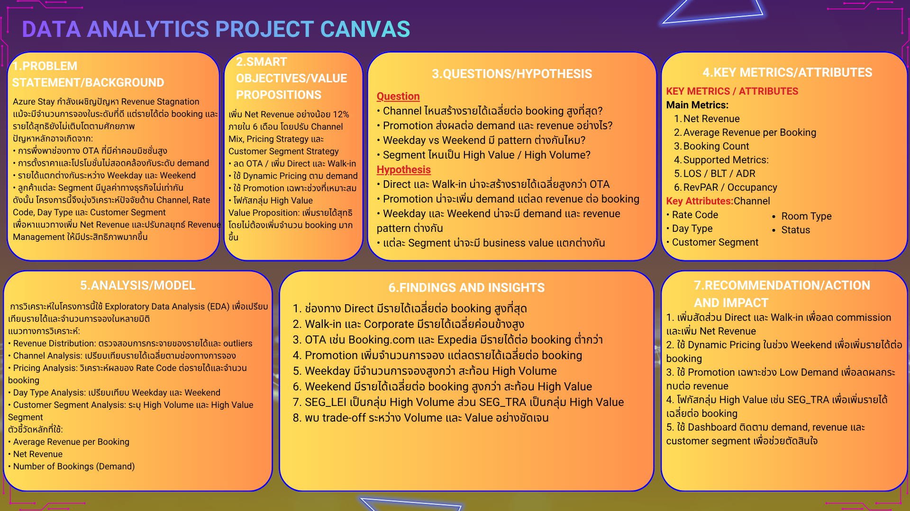

---

โครงการนี้จัดทำขึ้นเพื่อวิเคราะห์ปัญหา **Revenue Stagnation** ของโรงแรมสมมติ **Azure Stay** ซึ่งแม้จะมีจำนวนการจองในระดับที่ดี แต่รายได้ต่อห้องพักยังไม่เติบโตตามศักยภาพที่ควรจะเป็น

การวิเคราะห์นี้มุ่งเน้นการใช้แนวคิดด้าน **Business Intelligence, Data Analytics และ Exploratory Data Analysis (EDA)** เพื่อศึกษา:
- ผลกระทบของช่องทางการจอง (Booking Channel)
- ผลของกลยุทธ์ด้านราคา (Rate Code / Promotion)
- ความแตกต่างระหว่างช่วงเวลา (Weekend vs Weekday)
- คุณค่าทางธุรกิจของลูกค้าแต่ละกลุ่ม (Customer Segment)

โดยมีเป้าหมายเพื่อค้นหา insight ที่สามารถนำไปใช้ในการปรับกลยุทธ์ด้านราคาและการบริหารรายได้ของโรงแรมได้จริง

---

# 📌 1. Background & Pain Points

Azure Stay กำลังเผชิญปัญหา **Revenue Stagnation (รายได้หยุดนิ่ง)**  
แม้มีจำนวนผู้เข้าพักในระดับที่ดี แต่ค่า **RevPAR (Revenue Per Available Room)** ไม่เติบโต และไม่สอดคล้องกับต้นทุนการดำเนินงานที่เพิ่มขึ้น

สถานการณ์นี้สะท้อนถึงความไม่มีประสิทธิภาพในการบริหารรายได้ของโรงแรม โดยเฉพาะในด้าน **Pricing Strategy** และ **Inventory Management**

## ⚠️ Pain Points
- **Inefficient Pricing**  
  การตั้งราคาห้องพักไม่สอดคล้องกับระดับความต้องการ (Demand) ทำให้พลาดโอกาสในการเพิ่มรายได้

- **Poor Inventory Management**  
  การจัดการ Length of Stay (LOS) และ Booking Lead Time (BLT) ยังไม่เหมาะสม ทำให้ใช้ทรัพยากรห้องพักได้ไม่เต็มประสิทธิภาพ

- **Impact on Profitability**  
  RevPAR ที่ไม่เติบโตส่งผลต่อกำไร ความสามารถในการแข่งขัน และโอกาสในการสร้างรายได้ระยะยาว

> 💡 สรุป: ปัญหาไม่ได้อยู่ที่ จำนวน booking เพียงอย่างเดียว แต่เกี่ยวข้องกับคุณภาพของรายได้ ช่องทางการจอง และกลยุทธ์ด้านราคา

---

# 🎯 2. Objectives

โครงการนี้มีวัตถุประสงค์เพื่อ:

- วิเคราะห์ปัจจัยที่ทำให้รายได้ของโรงแรมไม่เติบโต เพื่อหาแนวทางเพิ่มค่า RevPAR ให้ได้ตามเป้าหมาย 5% ภายใน 6 เดือน
- วิเคราะห์ปัจจัยที่ทำให้รายได้ของโรงแรมไม่เติบโต
- ประเมินผลของ **Booking Channel**, **Rate Code**, **Day Type**, และ **Customer Segment** ต่อรายได้
- ศึกษา trade-off ระหว่าง **Demand (จำนวนการจอง)** และ **Revenue per Booking**
- ระบุโอกาสในการเพิ่มรายได้ผ่านการปรับ **Pricing Strategy**
- จัดทำ insight เพื่อสนับสนุนการตัดสินใจด้าน **Revenue Management**

---

# ❓ 3. Business Questions

คำถามทางธุรกิจหลักของโครงการนี้ ได้แก่:

1. ช่องทางการจองใดสร้างรายได้เฉลี่ยต่อ booking สูงที่สุด
2. โปรโมชั่นและส่วนลดส่งผลต่อจำนวนการจองและรายได้ต่อ booking อย่างไร
3. Weekend และ Weekday มีรูปแบบ demand และรายได้แตกต่างกันหรือไม่
4. Customer Segment ใดเป็นกลุ่ม High Volume และกลุ่มใดเป็น High Value
5. โรงแรมควรปรับกลยุทธ์ด้านราคาอย่างไรเพื่อเพิ่มรายได้โดยรวม

---

# 🧪 4. Hypotheses

## H1: Channel Effect
คาดว่าช่องทาง **Direct** และ **Corporate** จะมีรายได้เฉลี่ยต่อ booking สูงกว่าช่องทาง **OTA** เนื่องจาก OTA มีต้นทุนค่าคอมมิชชั่น

## H2: Pricing Effect
คาดว่า Rate Code ที่เป็นโปรโมชั่นหรือส่วนลดจะช่วยเพิ่มจำนวนการจอง (Demand) แต่ทำให้รายได้เฉลี่ยต่อ booking ลดลง

## H3: Demand Timing Effect
คาดว่า Weekday และ Weekend จะมีรูปแบบ demand และรายได้ต่างกัน โดยแต่ละช่วงเวลาควรใช้กลยุทธ์ pricing ที่แตกต่างกัน

---

# 🗂️ 5. Dataset Description

ชุดข้อมูลที่ใช้ในโครงการนี้เป็นข้อมูลการจองของโรงแรมที่สร้างขึ้นในรูปแบบ CSV เพื่อจำลองโครงสร้างข้อมูลจริงของธุรกิจโรงแรม

---

- จำนวนแถวข้อมูล: 9,515 แถว
- จำนวนตัวแปร: 25 คอลัมน์

---

## ไฟล์ข้อมูลหลัก
- `fact_bookings_clean.csv` : ตารางข้อมูลการจองหลัก
- `fact_bookings_enriched.csv` : ตารางข้อมูลที่ผ่านการรวมและเตรียมสำหรับการวิเคราะห์
- `dim_channels.csv` : ข้อมูลช่องทางการจอง
- `dim_rate_codes.csv` : ข้อมูลประเภทของราคา / โปรโมชั่น
- `dim_segments_clean.csv` : ข้อมูลกลุ่มลูกค้า
- `dim_calendar.csv` : ข้อมูลด้านวันและช่วงเวลา
- `dim_room_inventory.csv` : ข้อมูล capacity / inventory ของโรงแรม

## คอลัมน์สำคัญที่ใช้
- `channel_id`
- `rate_code_id`
- `segment_id`
- `day_type`
- `booking_id`
- `True_Room_Revenue`
- `Penalty_Revenue`
- `commission_amount`
- `net_realized_revenue`

---

# 🤖 6. การสร้างข้อมูลด้วย AI (Prompt และ Business Logic)

ชุดข้อมูลที่ใช้ในโครงการนี้เป็นข้อมูลสังเคราะห์ (Synthetic Data) ที่สร้างขึ้นด้วย Generative AI เพื่อจำลองสถานการณ์ทางธุรกิจของโรงแรม Azure Stay ให้มีโครงสร้างใกล้เคียงกับข้อมูลจริง และสอดคล้องกับโจทย์ด้าน Revenue Management

## Prompt ที่ใช้ในการสร้างข้อมูล

ข้อความแจ้งเตือน (Prompt) ที่ใช้ในการสร้างข้อมูล มีแนวคิดดังนี้:

“สร้างชุดข้อมูลการจองโรงแรมแบบสังเคราะห์ โดยให้มีทั้งตารางข้อมูลหลักและตารางมิติ ได้แก่ fact_bookings, dim_channels, dim_rate_codes, dim_segments และ dim_calendar ข้อมูลต้องสะท้อน business logic ของโรงแรมจริง เช่น ช่องทาง OTA มีค่าคอมมิชชั่น ช่องทาง Direct และ Walk-in ไม่มีค่าคอมมิชชั่น รายการ no-show ต้องไม่มีรายได้จากการเข้าพักจริง แต่สามารถมีค่าปรับได้ โปรโมชั่นควรช่วยเพิ่มจำนวนการจอง แต่ลดรายได้เฉลี่ยต่อ booking และการจองในช่วง Weekend ควรมีรายได้ต่อ booking สูงกว่า Weekday”

## คำจำกัดความและคำอธิบายของตัวแปรสำคัญ

### ตัวแปรวัด (Measures)

- **True_Room_Revenue**  
  รายได้จากการเข้าพักจริงของลูกค้า โดยไม่รวมกรณี no-show

- **Penalty_Revenue**  
  รายได้จากค่าปรับที่เกิดจากกรณี cancel หรือ no-show

- **commission_amount**  
  ค่าคอมมิชชั่นที่โรงแรมต้องจ่ายให้ช่องทาง OTA

- **net_realized_revenue**  
  รายได้ที่โรงแรมได้รับจริงจาก booking นั้น หลังพิจารณารายได้จากการเข้าพักจริงและค่าปรับ

## วิธีการคำนวณตัวแปรวัด

- **Net Revenue** = Total Revenue - Commission Amount
- **Net Realized Revenue** = True Room Revenue + Penalty Revenue

## ตัวแปรมิติ (Dimensions)

- **channel_id**  
  ช่องทางการจอง เช่น CH_DIR, CH_WLK, CH_BKG, CH_EXP, CH_COR

- **rate_code_id**  
  ประเภทของราคา เช่น RC_RACK, RC_PROMO, RC_NONREF, RC_CORP

- **segment_id**  
  กลุ่มลูกค้า เช่น SEG_LEI, SEG_TRA, SEG_GRP, SEG_BUS

- **day_type**  
  ประเภทของวัน แบ่งเป็น Weekday และ Weekend

## ตัวแปรที่ได้มาจากคำสั่งเงื่อนไข (Derived Dimensions / Conditional Logic)

- **day_type**  
  หากวันเข้าพักอยู่ในวันเสาร์หรือวันอาทิตย์ จะถูกกำหนดเป็น Weekend  
  หากเป็นวันจันทร์ถึงวันศุกร์ จะถูกกำหนดเป็น Weekday

- **No-show Logic**  
  หาก booking มีสถานะเป็น no-show:
  - True_Room_Revenue = 0
  - Penalty_Revenue อาจมีค่าได้
  - net_realized_revenue จะสะท้อนเฉพาะค่าปรับที่ได้รับจริง

  ---

# 🧹 7. Data Cleaning & Preparation

ก่อนทำการวิเคราะห์ ได้มีการเตรียมและตรวจสอบข้อมูลดังนี้:

- ตรวจสอบ Missing Values
- ตรวจสอบความซ้ำซ้อนของ `booking_id`
- ตรวจสอบความถูกต้องของรายได้
- แยกรายได้ออกเป็น:
  - **True Room Revenue** = รายได้จากการเข้าพักจริง
  - **Penalty Revenue** = รายได้จากค่าปรับกรณี cancel / no-show
- เพิ่มคอลัมน์ `day_type` เพื่อแบ่งข้อมูลเป็น **Weekend** และ **Weekday**
- ตรวจสอบ consistency ของ commission และ net revenue

> หมายเหตุ: ชุดข้อมูลนี้ถูกออกแบบให้สะท้อน business logic ของโรงแรม เช่น OTA commission, promotional pricing และ customer segment behavior

---

# 📊 8. Exploratory Data Analysis (EDA)

## 1) Booking Channel Analysis

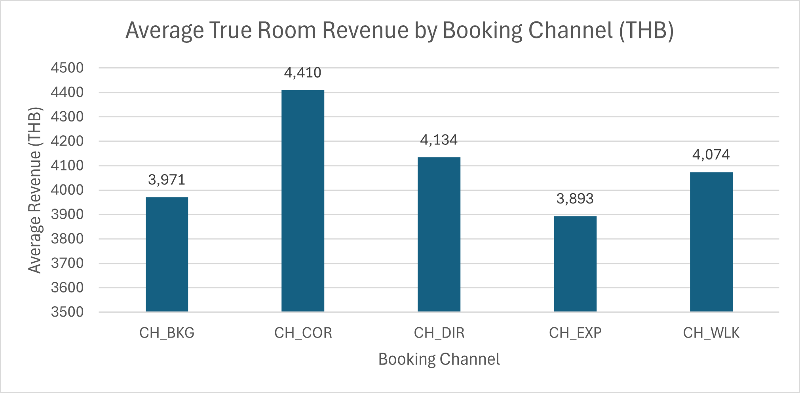

📌 **Insight:**  
ช่องทาง **CH_DIR (Direct)** มีรายได้เฉลี่ยต่อ booking สูงที่สุด  
รองลงมาคือ **CH_WLK (Walk-in)** และ **CH_COR (Corporate)**  
ขณะที่ช่องทาง OTA เช่น **CH_EXP (Expedia)** และ **CH_BKG (Booking.com)**  
มีรายได้เฉลี่ยต่อ booking ต่ำกว่าอย่างชัดเจน

📌 **Impact:**  
ผลลัพธ์นี้สะท้อนว่า OTA แม้ช่วยเพิ่มการเข้าถึงลูกค้าและเพิ่มจำนวนการจอง  
แต่มีต้นทุนค่าคอมมิชชั่นที่ทำให้รายได้สุทธิต่อ booking ต่ำกว่า  

ในขณะที่ช่องทาง **Direct** และ **Walk-in** ไม่มีค่าคอมมิชชั่น  
จึงสามารถสร้างรายได้ต่อ booking ได้สูงกว่า  

ดังนั้น โรงแรมควรเพิ่มสัดส่วน **Direct Booking** และ **Walk-in Booking**  
เพื่อลดต้นทุนและเพิ่มกำไรสุทธิในระยะยาว

📌 **Note:**  
Revenue ในกราฟนี้ใช้ **Net Realized Revenue** ซึ่งรวมผลกระทบจากค่าคอมมิชชั่น  
และสะท้อนรายได้สุทธิที่โรงแรมได้รับจริง

---

## 2) Pricing Analysis

Promotion ช่วยเพิ่มจำนวนการจอง แต่ลดรายได้เฉลี่ยต่อ booking  
แสดงถึง trade-off ระหว่าง **Demand** และ **Revenue**

### Average Revenue by Rate Code
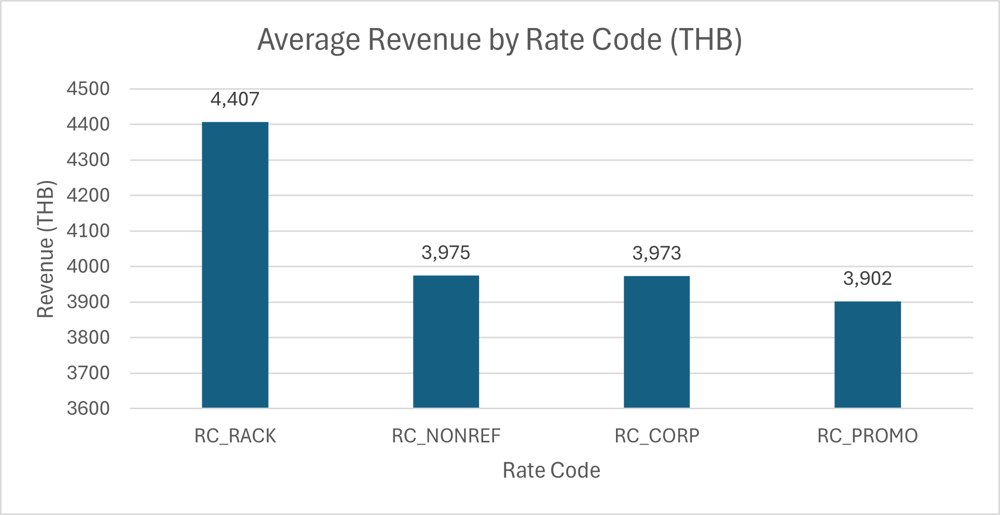

📌 **Insight:**  
RC_RACK มีรายได้เฉลี่ยต่อ booking สูงที่สุด ขณะที่ RC_PROMO มีรายได้เฉลี่ยต่ำที่สุด  
สะท้อนว่า Rate Code ที่ไม่มีส่วนลดสามารถสร้างรายได้ต่อ booking ได้สูงกว่า  

ในขณะที่ Rate Code แบบโปรโมชั่น แม้ช่วยกระตุ้น demand  
แต่มีผลให้รายได้เฉลี่ยต่อ booking ลดลงอย่างชัดเจน

📌 **Impact:**  
ผลลัพธ์นี้สะท้อนถึง trade-off ระหว่าง Demand และ Revenue  

โปรโมชั่น (RC_PROMO) ช่วยเพิ่มจำนวนการจอง  
แต่ลดรายได้เฉลี่ยต่อ booking  

ดังนั้น โรงแรมควรใช้โปรโมชั่นเฉพาะในช่วงที่ demand ต่ำ  
และหลีกเลี่ยงการใช้ส่วนลดในช่วงที่ demand สูง  
เพื่อเพิ่มประสิทธิภาพในการสร้างรายได้ต่อ booking

📌 **Business Insight:**  
การใช้ Rate Code ควรถูกออกแบบให้สอดคล้องกับระดับ demand  
เพื่อสร้างสมดุลระหว่าง Volume และ Profitability

---

### Number of Bookings by Rate Code
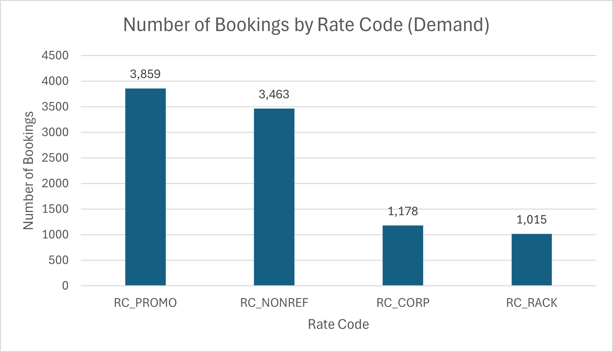

📌 **Insight:**  
**RC_PROMO** มีจำนวนการจองสูงที่สุด รองลงมาคือ **RC_NONREF**  
ในขณะที่ **RC_RACK** มีจำนวนการจองต่ำที่สุด

📌 **Impact:**  
โปรโมชั่นช่วยเพิ่ม demand ได้อย่างชัดเจน แต่เมื่อนำไปพิจารณาร่วมกับกราฟรายได้ จะพบว่า demand ที่เพิ่มขึ้นไม่ได้แปลว่ารายได้ต่อ booking จะดีขึ้นเสมอ  
ดังนั้นโรงแรมควรบริหาร Rate Code ให้สมดุลระหว่าง **Volume** และ **Value**

📌 **Business Insight:**  
การกำหนด Rate Code ควรสอดคล้องกับระดับ demand  
เพื่อสร้างสมดุลระหว่างจำนวนการจอง (Volume) และรายได้ต่อ booking (Profitability)

---

## 3) Time Analysis (Weekend vs Weekday)

Weekday มีจำนวนการจองสูงกว่า  
ขณะที่ Weekend มีรายได้เฉลี่ยต่อ booking สูงกว่า

### Number of Bookings by Day Type
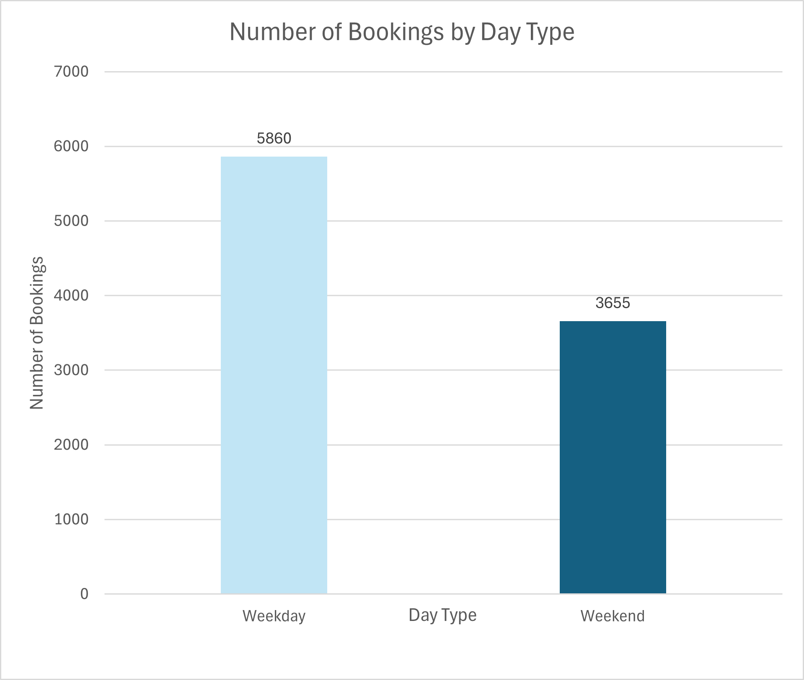

📌 **Insight:**  
**Weekday** มีจำนวนการจองสูงกว่า **Weekend** อย่างชัดเจน  
สะท้อนว่ารายได้ของโรงแรมในวันธรรมดาถูกขับเคลื่อนด้วยปริมาณการจอง (Volume-driven)

📌 **Impact:**  
โรงแรมควรเน้นกลยุทธ์เพิ่ม occupancy และบริหาร demand ในช่วง Weekday  
เช่น การทำแพ็กเกจสำหรับลูกค้าธุรกิจหรือการส่งเสริมการจองล่วงหน้า

---

### Average Revenue by Day Type
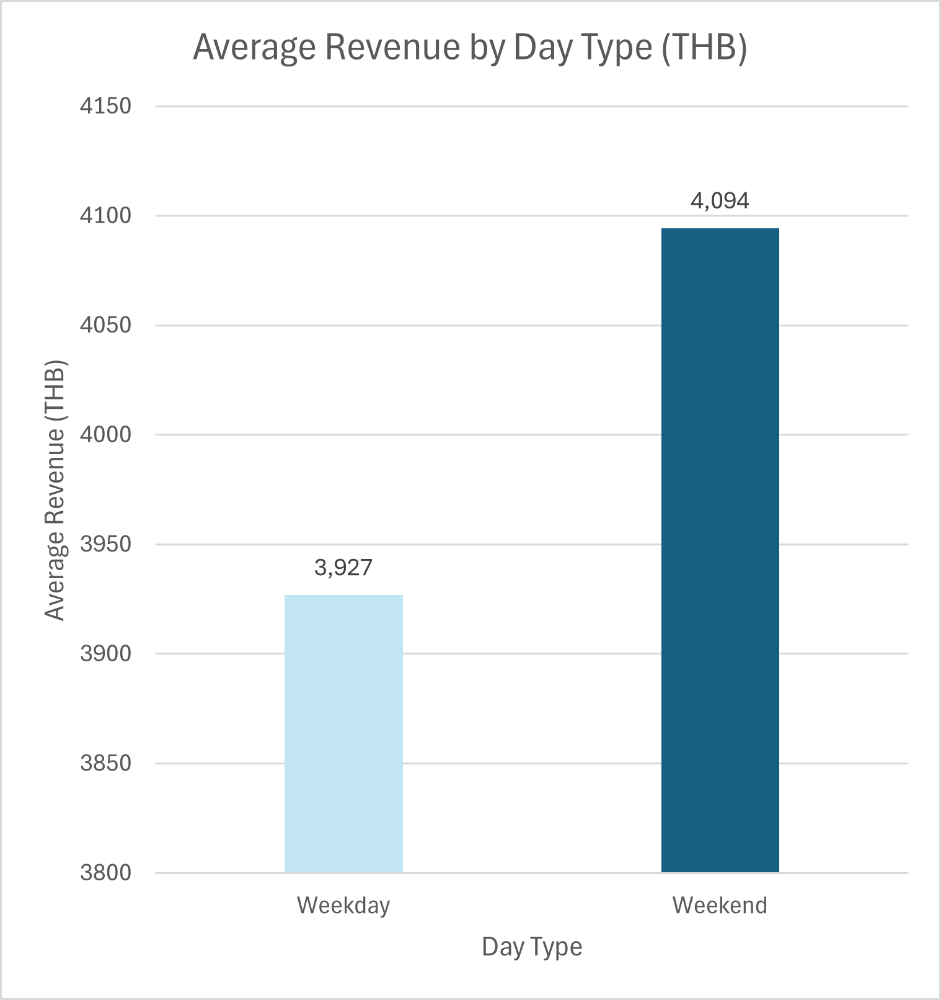

📌 **Insight:**  
แม้ **Weekend** จะมีจำนวนการจองน้อยกว่า แต่มีรายได้เฉลี่ยต่อ booking สูงกว่า **Weekday**  
สะท้อนว่าลูกค้ามีแนวโน้มยอมจ่ายในราคาที่สูงขึ้นในช่วงวันหยุด

📌 **Impact:**  
โรงแรมสามารถใช้ **Dynamic Pricing** เพื่อเพิ่มรายได้ในช่วง Weekend ได้มากขึ้น  
โดยเน้นการตั้งราคาตาม demand แทนการเน้นเพิ่มจำนวน booking เพียงอย่างเดียว

---

## 4) Customer Segment Analysis

SEG_LEI เป็นกลุ่ม **High Volume**  
ขณะที่ SEG_TRA เป็นกลุ่ม **High Value**

### Average Revenue per Booking by Customer Segment
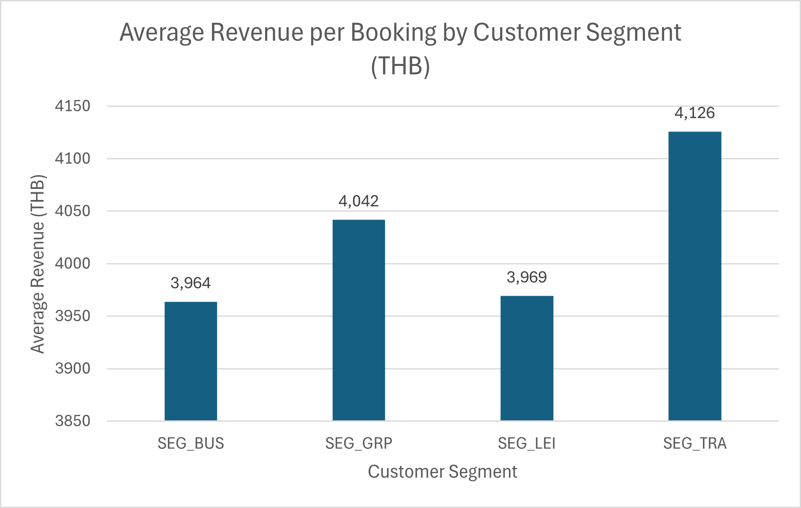

📌 **Insight:**  
กลุ่ม **SEG_TRA** มีรายได้เฉลี่ยต่อ booking สูงที่สุด รองลงมาคือ **SEG_GRP**  
ขณะที่ **SEG_LEI** และ **SEG_BUS** มีรายได้ต่อ booking ต่ำกว่า  

สะท้อนว่าลูกค้าแต่ละ Segment มีมูลค่าทางธุรกิจแตกต่างกันอย่างชัดเจน  
โดยบางกลุ่มสร้างรายได้ต่อ booking ได้สูงกว่ากลุ่มอื่นอย่างมีนัยสำคัญ

📌 **Impact:**  
ผลลัพธ์นี้แสดงให้เห็นว่าไม่ใช่ทุก Segment จะสร้างคุณค่าเท่ากัน  

กลุ่ม **SEG_TRA** จัดเป็น High Value Segment  
ซึ่งสามารถสร้างรายได้ต่อ booking ได้สูง  

ดังนั้น โรงแรมควรเพิ่ม focus ไปยังกลุ่มลูกค้าที่มีมูลค่าสูง  
เช่น การออกแบบ package หรือบริการที่ตอบโจทย์กลุ่มนี้  

ขณะเดียวกัน ควรบริหารกลุ่ม High Volume เช่น SEG_LEI  
ให้สามารถสร้างรายได้ได้อย่างมีประสิทธิภาพมากขึ้น

📌 **Business Insight:**  
การบริหาร Customer Segment ควรคำนึงถึงทั้ง Volume และ Value  
เพื่อสร้างสมดุลระหว่างจำนวนการจองและรายได้ต่อ booking

---

### Number of Bookings by Customer Segment
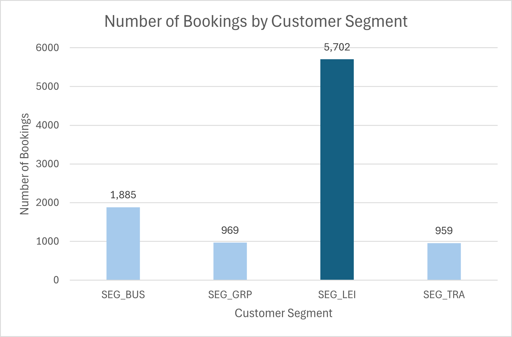

📌 **Insight:**  
**SEG_LEI** มีจำนวนการจองสูงที่สุดอย่างชัดเจน จัดเป็นกลุ่ม **High Volume**  
ขณะที่ **SEG_TRA** และ **SEG_GRP** มีจำนวนการจองต่ำกว่า

📌 **Impact:**  
แม้กลุ่ม High Volume จะช่วยสร้าง occupancy แต่ไม่ได้หมายความว่าจะสร้างรายได้ต่อ booking สูงที่สุด  
ดังนั้นโรงแรมควรปรับสมดุลระหว่างลูกค้า **High Volume** และ **High Value** เพื่อเพิ่มประสิทธิภาพด้านรายได้โดยรวม

📌 **Business Insight:**  
การบริหาร Customer Segment ควรพิจารณาทั้ง Demand (Volume) และ Value  เพื่อให้สามารถเพิ่มทั้ง occupancy และ profitability ได้พร้อมกัน

---

## 📊 Additional Analysis

### Revenue Distribution

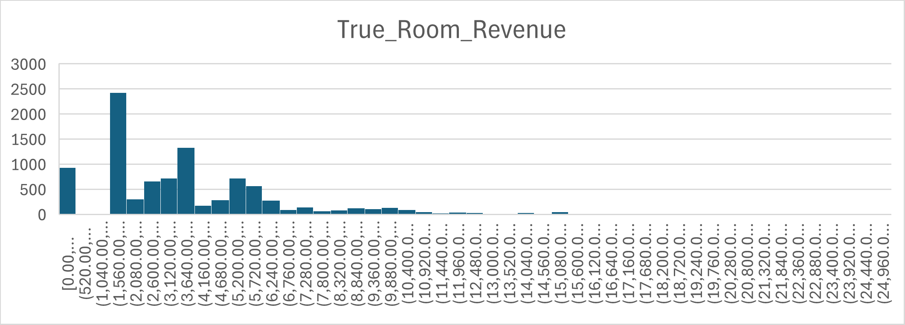

การกระจายของ **True Room Revenue** มีลักษณะ **เบ้ขวา (Right-skewed)**  
โดยรายได้ส่วนใหญ่กระจุกตัวอยู่ในช่วงระดับกลาง ประมาณ **2,000 – 6,000 THB**

อย่างไรก็ตาม มี booking บางส่วนที่มีมูลค่าสูงมาก ซึ่งส่งผลให้ค่าเฉลี่ย (Mean) สูงขึ้น  
สะท้อนถึงการมี **High-value booking** เช่น ลูกค้ากลุ่มพรีเมียมหรือ **group booking**

---

### Outlier Detection (Revenue)

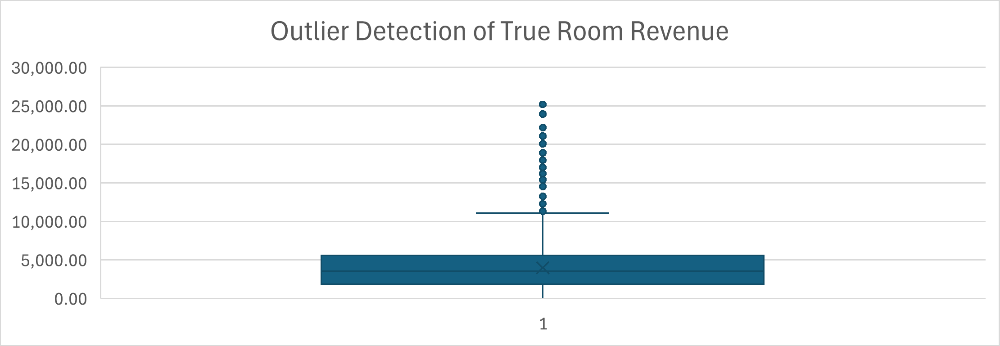

จาก Boxplot พบว่า:

- มี **outliers จำนวนมาก** ในช่วงรายได้สูง (มากกว่า ~10,000 THB)
- ค่าเฉลี่ย (Mean) สูงกว่าค่ามัธยฐาน (Median) อย่างชัดเจน  
  → ยืนยันว่าข้อมูลมีการกระจายแบบ skewed

📌 Insight:
- รายได้ของโรงแรมไม่ได้มาจาก booking ทั่วไปเท่านั้น  
- แต่มี booking มูลค่าสูงที่ช่วย **boost revenue อย่างมีนัยสำคัญ**

📌 Implication:
- ควรแยกวิเคราะห์กลุ่มลูกค้า High-value ออกมาเฉพาะ  
- เพื่อนำไปออกแบบ **pricing strategy / premium offering** ได้ดียิ่งขึ้น

---

# 💡 Key Findings and Insights

จากการวิเคราะห์ข้อมูลการจองของโรงแรม Azure Stay พบประเด็นสำคัญที่สะท้อนโครงสร้างรายได้และโอกาสในการปรับกลยุทธ์ด้าน Revenue Management ดังนี้

1. ประสิทธิภาพของช่องทางการจอง (Channel Performance)

ช่องทาง Direct มีรายได้เฉลี่ยต่อ booking สูงที่สุด รองลงมาคือ Walk-in และ Corporate  
ขณะที่ช่องทาง OTA เช่น Booking และ Expedia มีรายได้เฉลี่ยต่ำกว่าอย่างชัดเจน

ในทางกลับกัน ช่องทาง OTA แม้ช่วยเพิ่มจำนวนการจอง  
แต่มีต้นทุนค่าคอมมิชชั่น ทำให้รายได้สุทธิต่อ booking ต่ำกว่า

📌 Insight:
โรงแรมควรเพิ่มสัดส่วน Direct Booking และ Walk-in  
เพื่อลดต้นทุนและเพิ่ม profitability ในระยะยาว

---

### 2. ผลของกลยุทธ์ด้านราคา (Pricing Strategy Effect)
- Rate Code ที่เป็นโปรโมชั่น เช่น **RC_PROMO** มีจำนวนการจองสูง (High Demand) แต่สร้างรายได้เฉลี่ยต่อ booking ต่ำ
- ขณะที่ Rate Code ปกติ เช่น **RC_RACK** มีรายได้ต่อ booking สูงกว่า แต่มีจำนวนการจองน้อยกว่า

📌 Insight:  
โปรโมชั่นช่วยกระตุ้น demand ได้จริง แต่มี trade-off กับรายได้ต่อ booking จึงควรใช้เฉพาะในช่วง low demand หรือใช้กับลูกค้าบางกลุ่มอย่างมีกลยุทธ์

---

### 3. ความแตกต่างระหว่าง Weekday และ Weekend (Demand Timing Pattern)
- **Weekday** มีจำนวนการจองสูงกว่า สะท้อนการขับเคลื่อนรายได้ด้วยปริมาณการจอง (Volume-driven)
- **Weekend** มีรายได้เฉลี่ยต่อ booking สูงกว่า สะท้อนการขับเคลื่อนรายได้ด้วยมูลค่าต่อ booking (Value-driven)

📌 Insight:  
โรงแรมควรใช้ pricing strategy ที่แตกต่างกันตามช่วงเวลา โดย Weekday เน้น occupancy และ Weekend เน้นการเพิ่มรายได้ต่อ booking

---

### 4. คุณค่าทางธุรกิจของลูกค้าแต่ละกลุ่ม (Customer Segment Value)
- กลุ่ม **SEG_LEI** มีจำนวนการจองสูงที่สุด จัดเป็นกลุ่ม **High Volume**
- กลุ่ม **SEG_TRA** มีรายได้เฉลี่ยต่อ booking สูงที่สุด จัดเป็นกลุ่ม **High Value**

📌 Insight:  
ลูกค้าแต่ละ segment ไม่ได้มีคุณค่าทางธุรกิจเท่ากัน โรงแรมควรเพิ่ม focus ไปยังกลุ่ม High Value มากขึ้น เพื่อยกระดับรายได้เฉลี่ยในระยะยาว

---

### 5. ภาพรวมเชิงกลยุทธ์ (Overall Business Implication)
- ปัญหารายได้ของโรงแรมไม่ได้เกิดจากจำนวนการจองน้อยเพียงอย่างเดียว
- แต่เกิดจากโครงสร้างรายได้ที่ยังไม่เหมาะสม ทั้งในมิติของช่องทาง ราคา ช่วงเวลา และกลุ่มลูกค้า

📌 Insight:  
Azure Stay ยังมีโอกาสเพิ่มรายได้ได้อีก ผ่านการใช้ **Dynamic Pricing**, การเพิ่ม **Direct Booking**, และการบริหารสัดส่วนลูกค้าให้สมดุลระหว่าง **High Volume** และ **High Value**

---

# 💡 9. Strategic Recommendations

จากผลการวิเคราะห์ข้อมูลด้าน Channel, Pricing, Time และ Customer Segment  
สามารถสรุปข้อเสนอเชิงกลยุทธ์เพื่อเพิ่มรายได้ (Revenue Optimization) ได้ดังนี้:

---

### 1. 📈 เพิ่มสัดส่วน Direct Booking (Channel Optimization)
- ส่งเสริมช่องทาง Direct เช่น Website / Walk-in
- ลดการพึ่งพา OTA และเพิ่มสัดส่วนช่องทางที่ไม่มีค่าคอมมิชชั่น
- ใช้โปรโมชั่นเฉพาะช่องทาง Direct เพื่อดึงลูกค้าเข้ามาโดยตรง

📌 Impact:
- เพิ่ม Net Revenue ต่อ booking
- ลดต้นทุนค่าคอมมิชชั่นระยะยาว

---

### 2. 💰 ใช้ Dynamic Pricing ตาม Demand (Pricing Strategy)
- ปรับราคาห้องพักให้สูงขึ้นในช่วงที่ demand สูง (เช่น Weekend)
- ใช้ข้อมูล booking pattern เพื่อกำหนดราคาที่เหมาะสมในแต่ละช่วงเวลา

📌 Insight รองรับ:
- Weekend demand สูง แต่ ADR ยังเพิ่มไม่มาก → ยังมี room ให้ขึ้นราคา

📌 Impact:
- เพิ่มรายได้โดยไม่ต้องเพิ่มจำนวน booking

---

### 3. 🎯 บริหาร Rate Code อย่างมี Strategy (Promotion Optimization)
- ใช้โปรโมชั่น (RC_PROMO) เพื่อกระตุ้น demand ในช่วง low demand เท่านั้น
- หลีกเลี่ยงการใช้ promo ในช่วง demand สูง (จะเสียโอกาสทำกำไร)
- แยก segment ลูกค้าให้ชัดว่าใครควรได้ discount

📌 Insight รองรับ:
- Promo → booking สูง แต่ revenue ต่อ booking ต่ำ (trade-off)

📌 Impact:
- Balance ระหว่าง Volume และ Profit

---

### 4. 👥 โฟกัส High Value Customer Segment (Customer Strategy)
- เพิ่ม focus ไปที่ segment ที่มีรายได้ต่อ booking สูง (เช่น SEG_TRA / SEG_GRP)
- ออกแบบ package หรือ premium offering สำหรับลูกค้ากลุ่มนี้
- ใช้ loyalty program เพื่อรักษาลูกค้ามูลค่าสูง

📌 Insight รองรับ:
- บาง segment มี High Volume แต่ Low Value
- บาง segment มี Low Volume แต่ High Value

📌 Impact:
- เพิ่ม Average Revenue ต่อ booking (ADR)

---

### 5. 📊 ใช้ Data-Driven Decision ใน Revenue Management
- ใช้ข้อมูล Demand, Channel, Segment และ Pricing ร่วมกันในการตัดสินใจ
- สร้าง dashboard (Tableau) สำหรับ monitor performance แบบ real-time
- วางแผน capacity และ pricing ล่วงหน้าจาก historical data

📌 Impact:
- ตัดสินใจได้แม่นยำขึ้น
- เพิ่มประสิทธิภาพการบริหารรายได้ (Revenue Management)

---

## ✅ Overall Business Impact

- เพิ่มรายได้ต่อ booking (ADR)
- ลดต้นทุนจาก commission
- ใช้ demand ให้เกิดประโยชน์สูงสุด
- ปรับ pricing ได้เหมาะสมกับตลาด
- สร้างความได้เปรียบเชิงการแข่งขันในระยะยาว

---

# 🧾 10. Conclusion

จากการวิเคราะห์ข้อมูลการจองของโรงแรม Azure Stay พบว่า ปัญหา Revenue Stagnation ไม่ได้เกิดจากจำนวนการจองที่ต่ำ แต่เกิดจากโครงสร้างรายได้ที่ยังไม่มีประสิทธิภาพในหลายมิติ โดยเฉพาะการพึ่งพาช่องทาง OTA มากเกินไป ซึ่งแม้จะช่วยเพิ่มจำนวนการจอง แต่มีต้นทุนค่าคอมมิชชั่นสูง ส่งผลให้รายได้สุทธิต่อ booking ต่ำลง ขณะเดียวกัน กลยุทธ์ด้านราคาและโปรโมชั่นยังไม่สอดคล้องกับระดับ demand ในแต่ละช่วงเวลา ส่งผลให้โรงแรมเสียโอกาสในการเพิ่มรายได้ในช่วงที่ลูกค้ามี willingness to pay สูง นอกจากนี้ การบริหารลูกค้าแต่ละ segment ยังไม่สามารถดึงศักยภาพด้านรายได้ออกมาได้เต็มที่ เนื่องจากยังไม่มีการแยกกลยุทธ์ระหว่างกลุ่ม High Volume และ High Value อย่างชัดเจน

ผลการวิเคราะห์ชี้ให้เห็นว่า โรงแรมสามารถเพิ่มรายได้ได้โดยไม่จำเป็นต้องเพิ่มจำนวน booking แต่ต้องอาศัยการปรับกลยุทธ์ด้าน Revenue Management อย่างเป็นระบบ ทั้งในด้านการเพิ่มสัดส่วน Direct Booking เพื่อลดต้นทุน การใช้ Dynamic Pricing ให้สอดคล้องกับระดับ demand การบริหาร Rate Code อย่างมีกลยุทธ์ และการเพิ่ม focus ไปยังกลุ่มลูกค้าที่มีมูลค่าสูง โดยรวมแล้ว การนำแนวคิด Data-Driven Decision มาใช้จะช่วยให้ Azure Stay สามารถเพิ่มทั้งรายได้และ profitability ได้อย่างมีประสิทธิภาพ พร้อมทั้งสร้างความได้เปรียบในการแข่งขันในระยะยาว

---

# 📈 11. Dashboard

Dashboard นี้ถูกพัฒนาด้วย Tableau เพื่อสรุปผลการวิเคราะห์ธุรกิจโรงแรม Azure Stay ในมิติสำคัญ ได้แก่ Booking Channel, Rate Code, Day Type และ Customer Segment

ผู้ใช้งานสามารถใช้ Dashboard นี้เพื่อติดตามแนวโน้มรายได้ (Revenue), จำนวนการจอง (Demand), และเปรียบเทียบประสิทธิภาพของแต่ละช่องทางการขายหรือกลุ่มลูกค้าได้อย่างรวดเร็วในหน้าเดียว

Dashboard นี้ช่วยสนับสนุนการตัดสินใจด้าน Revenue Management เช่น การปรับราคา การเลือกช่องทางขาย และการวางแผนกลยุทธ์ทางธุรกิจจากข้อมูลจริง

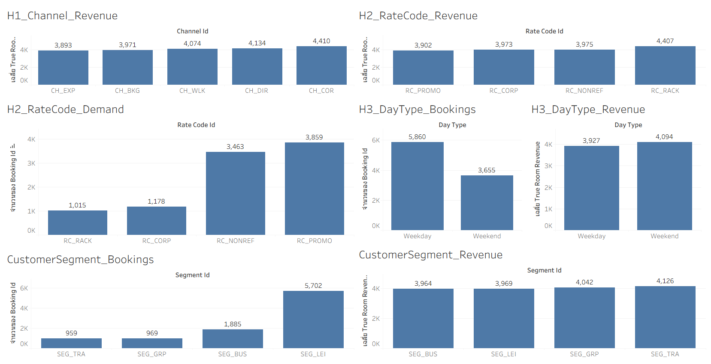

Dashboard นี้ช่วยให้สามารถมองเห็นภาพรวมของรายได้และ demand ได้ในหน้าเดียว และสนับสนุนการตัดสินใจเชิงธุรกิจได้อย่างมีประสิทธิภาพ

### Key Uses of Dashboard
- ติดตามรายได้เฉลี่ยตามช่องทางการจอง
- วิเคราะห์ผลกระทบของโปรโมชั่นและ Rate Code
- เปรียบเทียบ Weekday vs Weekend
- ระบุกลุ่มลูกค้า High Volume / High Value
- สนับสนุนการตัดสินใจเชิงกลยุทธ์

---

# 📁 12. Repository Structure

```bash
azure-stay-revenue-analysis/
├── analysis/
│   └── EDA_hotel_revenue_analysis.xlsx
├── data/
│   ├── raw/
│   │   ├── dim_calendar.csv
│   │   ├── dim_channels.csv
│   │   ├── dim_rate_codes.csv
│   │   ├── dim_room_inventory.csv
│   │   ├── dim_segments_clean.csv
│   │   └── fact_bookings_clean.csv
│   └── processed/
│       └── fact_bookings_enriched.csv
├── images/
│   ├── h1_channel_average_revenue.png
│   ├── h2_ratecode_average_revenue.png
│   ├── number_of_bookings_by_rate_code.png
│   ├── h3_daytype_bookings.png
│   ├── h3_daytype_revenue.png
│   ├── customer_segment_revenue_per_booking.png
│   ├── customer_segment_number_of_bookings.png
│   ├── revenue_vs_adults.png
│   ├── revenue_vs_commission.png
│   ├── true_room_revenue_distribution.png
│   └── eda_outlier_revenue.png
tableau/
 ├── README.md
 ├── Hotel_Tableau_Dashbord.twb
 └── Tabluea_Dashbord_Image.png
├── slides/
    ├── README.md
    ├── Azure_Stay_Presentation.pptx   
│   └── Azure_Stay_Presentation.pdf
└── README.md
```

---

## 13. รายชื่อผู้จัดทำ (Contributors)

โครงการนี้จัดทำขึ้นโดยสมาชิกในทีมดังต่อไปนี้

- ก้องภพ เลาหะพิพัฒน์ชัย 66102010231
- ภคพล  ต้นสาลี 66102010243
- แอนดี้  ทองลิบ 66102010247

---

# 🧑‍💻 Presentation Documents

- 📄 [Presentation (PDF)](slides/Azure_Stay_Presentation.pdf)
- 📊 [Presentation (PPTX)](slides/Azure_Stay_Presentation.pptx)
